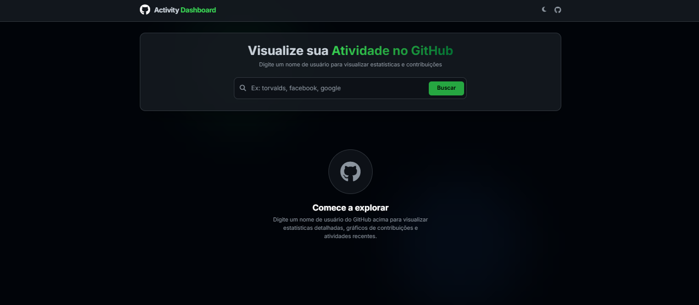

# GitHub Activity Dashboard Web

## 📋 O que é este projeto?

**GitHub Activity Dashboard** é uma aplicação web moderna e responsiva para visualizar o perfil e as estatísticas de qualquer usuário do GitHub.

Com design em **glassmorphism**, tema claro/escuro e animações fluidas, ela oferece uma visão completa e visual do perfil, incluindo:

- Informações detalhadas do perfil (avatar, bio, localização, empresa, website)
- Estatísticas principais (repositórios, seguidores, estrelas recebidas)
- Gráfico de contribuições (último ano com 52 semanas)
- Linguagens de programação mais usadas
- Repositórios recentes e atividades
- **Tema claro e escuro** com persistência em localStorage

## ✨ Funcionalidades

- 🔍 **Busca rápida** por username do GitHub
- 👤 **Perfil completo** com avatar, bio e informações de contato
- 📊 **Estatísticas animadas**: Repositórios, Seguidores, Seguindo, Estrelas
- 📈 **Gráfico de contribuições** interativo (último ano)
- 🎨 **Linguagens mais usadas** com gráficos de barras animados
- 📚 **Repositórios recentes** com descrições e metadados
- ⚡ **Atividades recentes** com ícones contextuais
- 🌙 **Tema claro/escuro** com preferência salva
- 📱 **Totalmente responsivo** (mobile-first)
- ✨ **Animações fluidas** e efeitos glassmorphism
- ⚡ **Zero dependências backend** - 100% frontend

## 🛠️ Como funciona?

1. **Digite o username** de qualquer usuário GitHub na barra de busca
2. **Clique em "Buscar"** ou pressione Enter
3. A app faz 2 requests paralelos:
   - `GET /users/{username}` → Perfil, avatar e informações
   - `GET /users/{username}/repos?sort=updated&per_page=100` → Últimos 100 repositórios
4. **Processa os dados**:
   - Extrai estatísticas (repositórios públicos, seguidores, estrelas)
   - Agrupa linguagens de programação por frequência (top 5)
   - Gera dados simulados de contribuições (52 semanas)
   - Formata informações de perfil, repositórios e atividades
5. **Renderiza o dashboard** com animações e efeitos visuais

### Fluxo técnico:

```
Frontend (HTML/JS/CSS + Tailwind)
    ↓
GitHub API v3 (sem autenticação)
    ↓
Processamento client-side (cálculos, agregações)
    ↓
Renderização (Animações + Tema claro/escuro)
    ↓
Persistência (localStorage para tema)
```

## 🚀 Como usar

1. **Abra `index.html`** no navegador:
   - Live Server (VS Code)
   - Direto no navegador (local ou hospedado)
   - Qualquer servidor web estático

2. **Digite um username válido** (exemplos: `octocat`, `torvalds`, `gvanrossum`, `facebook`)

3. **Clique em "Buscar"** ou pressione Enter

4. **Explore o dashboard**:
   - Visualize estatísticas animadas
   - Navegue pelo gráfico de contribuições
   - Clique em repositórios para abrir no GitHub
   - Clique em dias do gráfico para filtrar por data

5. **Alterne temas** usando o botão da lua/sol no topo direito

**Notas importantes**:
- Rate limit: **60 requests/hora** (API pública anônima)
- Sem autenticação necessária
- Funciona 100% no navegador (offline após carregar)

## 🏗️ Stack Tecnológica

| Camada    | Tecnologias                          |
|-----------|--------------------------------------|
| Frontend  | HTML5, Vanilla JavaScript (ES6+)    |
| API       | GitHub REST API v3 (públicas)        |
| CSS       | Tailwind CSS (CDN), Custom CSS       |
| Design   | Glassmorphism, Tema claro/escuro    |
| Bibliotecas | Font Awesome 6.4 (ícones)           |

## 📁 Estrutura do Projeto

```
github-activity-dashboard-web/
├── index.html      # Interface principal
├── script.js       # Lógica + API + Charts
├── style.css       # Estilos customizados (glass effect)
└── README.md       # Este arquivo
```

## 🎨 Preview

![Dashboard Preview]


## 🤝 Contribuições

1. Fork o projeto
2. Crie uma branch `feat/nova-funcionalidade`
3. Commit suas mudanças
4. Abra um Pull Request

## 📄 Licença

MIT License - sinta-se à vontade para usar e modificar!

## 🙏 Agradecimentos

- [GitHub API](https://docs.github.com/en/rest)
- [Chart.js](https://www.chartjs.org/)
- [Tailwind CSS](https://tailwindcss.com/)
